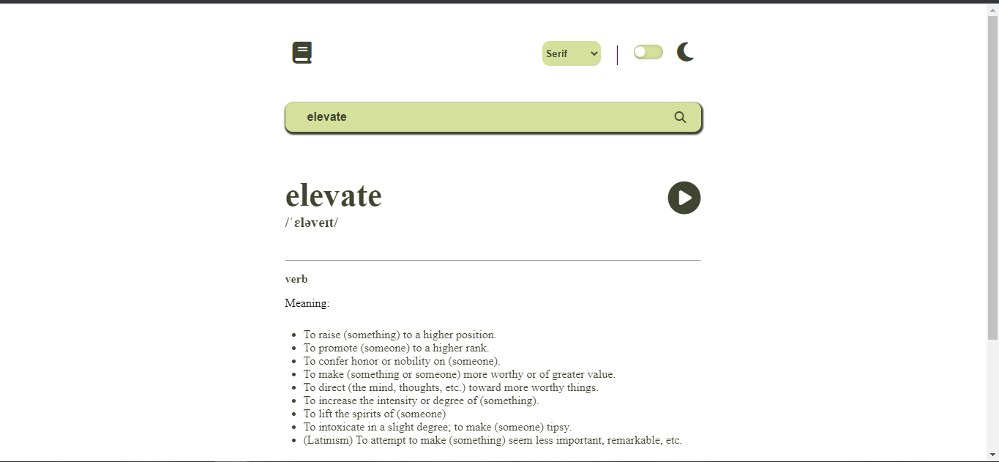

# Web Dictionary App

This is a Web Dictionary App. A challenge by the FrontendMentor site. In this app you can search for any word, see the phonetics of it and listen to the right pronunciation. 

The app has a dark theme switcher and a font family switcher, so you can choose between a serif font and a sans-serif one. It also has two types of validation, one if the input field is blank, without any word. And the other is if you mispelled your word. They both call an alert on the window.

This app was developed with HTML, CSS and Javascript.

## Author

- [@matheusfribeiro](https://github.com/matheusfribeiro)

## Demo

## Deploy

https://matheusfribeiro.github.io/dictionarywebapp/

